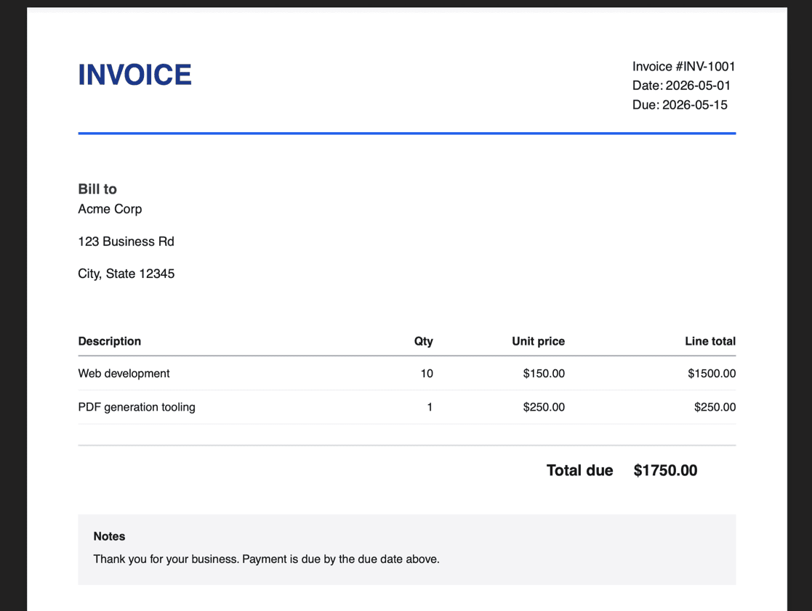

<!-- made using https://patorjk.com/software/taag/#p=display&f=Bulbhead&t=invoice-pdf-gen&x=none&v=4&h=4&w=80&we=false -->

A fast, lightweight CLI tool for generating beautiful invoice PDFs from JSON data. Built with [Bun](https://bun.sh) and [@react-pdf/renderer](https://react-pdf.org).

## Features

- **Fast Execution**: Powered by Bun for quick startup and rendering.
- **Simple Input**: Accepts a straightforward JSON structure via `stdin`.
- **Standalone Binary**: Can be compiled into a single executable for easy distribution.
- **Clean Design**: Generates professional, well-formatted invoices out of the box.


## Usage

`invoice-pdf-gen` reads JSON from standard input (`stdin`) and writes a PDF to the specified `--output` path.

```bash
# Using bundled bun file
cat demo.json | bun ./dist/invoice-pdf-gen.js -o demo.pdf
# Using compiled bin bun for macos
cat demo.json | ./dist/invoice-pdf-gen-macos -o demo.pdf
# Using compiled bin bun for linux
cat demo.json | ./dist/invoice-pdf-gen-linux -o demo.pdf
```

Output:


### CLI Options

| Option | Short | Description | Required |
|--------|-------|-------------|----------|
| `--output` | `-o` | Path to write the generated PDF file | **Yes** |
| `--template` | `-t` | Which template to use (e.g. modern) | No |
| `--help` | `-h` | Show help message | No |

### JSON Data Model

The application expects a single JSON object with the following structure:

```json
{
  "invoiceNumber": "INV-1001",
  "date": "2026-05-01",
  "dueDate": "2026-05-15",
  "billTo": {
    "name": "Acme Corp",
    "address": "123 Business Rd\nCity, State 12345"
  },
  "items": [
    {
      "description": "Web Development",
      "quantity": 10,
      "unitPrice": 150,
      "total": 1500
    }
  ],
  "totalAmount": 1500,
  "notes": "Thank you for your business!"
}
```

*Note: `dueDate` and `notes` are optional.*


## Installation

These are instructions for installing the app and app-completions to your zsh.

Pre-req: you have ~/.local/bin and ~/.zsh/completions setup.

### Option A — Download a release binary

Pre-req: Github GLI installed, or you could manually download the release bin from the Github website

```bash
gh release download --repo bdombro/invoice-pdf-gen --pattern 'invoice-pdf-gen-macos'
chmod +x invoice-pdf-gen-macos 
mv invoice-pdf-gen-macos ~/.local/bin/invoice-pdf-gen
export PATH="$HOME/.local/bin:$PATH"
invoice-pdf-gen completion zsh > ~/.zsh/completions/_invoice-pdf-gen
source ~/.zsh/completions/_invoice-pdf-gen
invoice-pdf-gen --help
```

### Option B: Build + install

How to clone the repository and install dependencies.

Pre-reqs:
- [Bun](https://bun.sh) installed (`curl -fsSL https://bun.sh/install | bash`)
- [Just](https://just.systems) used to run developer tasks


```bash
git clone git@github.com:bdombro/invoice-pdf-gen.git
cd invoice-pdf-gen
just build
cp dist/invoice-pdf-gen-macos ~/.local/bin/invoice-pdf-gen
export PATH="$HOME/.local/bin:$PATH"
invoice-pdf-gen completion zsh > ~/.zsh/completions/_invoice-pdf-gen
source ~/.zsh/completions/_invoice-pdf-gen
invoice-pdf-gen -h
```


## License

MIT -- see [LICENSE](LICENSE)